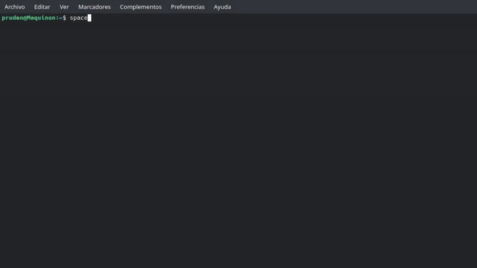

# Space Invaders en Rust 🦀

[](https://wakatime.com/badge/user/72f82c75-11de-43fd-979a-a5efbf06f882/project/cc46f16d-0430-4e87-97c1-cdb960672546)

Este es mi primer proyecto en Rust, es una réplica del mítico `Space Invaders` en `Rust` para el terminal en Linux.

### Mecánicas que incluye:
* Movimientos de jugador y disparo
* Movimientos de los aliens y disparos aleatorios de estos
* Distintos tipos de aliens
* UFO / OVNI random
* Sistema de puntuación
* Sistema de vidas
* Escudos

## 🎮 Instalación

1. 🔽 **Clona el repositorio**
   ```bash
   git clone https://github.com/PrudenK/space-invaders-rs
   ```

2. 🛠️ **Abre tu archivo `.bashrc`**
   ```bash
   nano ~/.bashrc
   ```

3. 🧩 **Añade este alias** (ajusta la ruta a tu proyecto):
   ```bash
   alias space_invaders='cd RustroverProjects/space-invaders-rs/ && cargo run --release'
   ```
4. 🔄 **Aplica los cambios**
   ```bash
   source ~/.bashrc
   ```
   
5. 🚀 **Ejecuta `space_invaders` en tu terminal y juega**

## 🖥️ Breve gameplay


<div align="center">
  
</div>